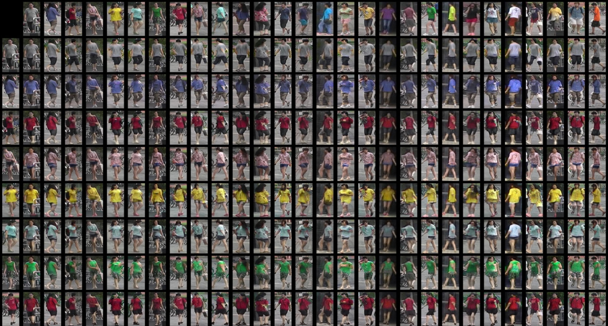

[](https://raw.githubusercontent.com/nvlabs/SPADE/master/LICENSE.md)


## Joint Discriminative and Generative Learning for Person Re-identification


[[Project]](http://zdzheng.xyz/DG-Net/) [[Paper]](https://arxiv.org/abs/1904.07223) [[YouTube]](https://www.youtube.com/watch?v=ubCrEAIpQs4) [[Bilibili]](https://www.bilibili.com/video/av51439240) [[Poster]](http://zdzheng.xyz/images/DGNet_poster.pdf)

Joint Discriminative and Generative Learning for Person Re-identification, CVPR 2019 (Oral)<br>
[Zhedong Zheng](http://zdzheng.xyz/), [Xiaodong Yang](https://xiaodongyang.org/), [Zhiding Yu](https://chrisding.github.io/), [Liang Zheng](http://liangzheng.com.cn/), [Yi Yang](https://www.uts.edu.au/staff/yi.yang), [Jan Kautz](http://jankautz.com/) <br>

## Table of contents
* [License](#license)
* [Features](#features)
* [Prerequisites](#prerequisites)
* [Getting Started](#getting-started)
    * [Installation](#installation)
    * [Dataset Preparation](#dataset-preparation)
    * [Testing](#testing)
    * [Training](#training)
* [DG-Market](#dg-market)
* [Tips](#tips)
* [Citation](#citation)
* [Related Work](#related-work)

## License

Copyright (C) 2019 NVIDIA Corporation.

All rights reserved.
Licensed under the [CC BY-NC-SA 4.0](https://creativecommons.org/licenses/by-nc-sa/4.0/legalcode) (**Attribution-NonCommercial-ShareAlike 4.0 International**)

The code is released for academic research use only. For commercial use, please contact [researchinquiries@nvidia.com](researchinquiries@nvidia.com).

## Features
We have supported:
- Float16 to save GPU memory based on [APEX](https://github.com/NVIDIA/apex)
- Multiple query evaluation
- Random erasing
- Visualize training curves
- Generate all figures in the paper 

## Prerequisites

- Python 3.6
- GPU Memory >= 15G 
- GPU Memory >= 10G (for fp16)
- NumPy
- PyTorch 1.0+
- [Optional] APEX (for fp16)

## Getting Started
### Installation
- Install [PyTorch](http://pytorch.org/) 
- Install torchvision from the source:
```
git clone https://github.com/pytorch/vision
cd vision
python setup.py install
```
- [Optional] You may skip it. Install APEX from the source:
```
git clone https://github.com/NVIDIA/apex.git
cd apex
python setup.py install --cuda_ext --cpp_ext
```
- Clone this repo
```bash
git clone https://github.com/NVlabs/DG-Net.git
cd DG-Net/
```

Our code is tested on PyTorch 1.0.0+ and torchvision 0.2.1+ .

### Dataset Preparation
Download the dataset [Market-1501](http://www.liangzheng.com.cn/Project/project_reid.html) 

Preparation: put the images with the same id in one folder. You may use 
```bash
python prepare-market.py          # for Market-1501
```
Note to modify the dataset path to your own path.

### Testing

#### Download the trained model
We provide our trained model. You may download it from [GoogleDrive](https://drive.google.com/open?id=1lL18FZX1uZMWKzaZOuPe3IuAdfUYyJKH) (or [BaiduDisk](https://pan.baidu.com/s/1503831XfW0y4g3PHir91yw) password: rqvf). You may download and move it to the `outputs`.
```
├── outputs/
│   ├── E0.5new_reid0.5_w30000
├── models
│   ├── best/                   
```
#### Person re-id evaluation
- Supervised learning

|   | Market-1501  | DukeMTMC-reID  | MSMT17  | CUHK03-NP |
|---|--------------|----------------|----------|-----------|
| Rank@1 | 94.8% | 86.6% | 77.2% | 65.6% |
| mAP    | 86.0% | 74.8% | 52.3% | 61.1% |


- Transfer learning     
To verify the generalizability of DG-Net, we train the model on dataset A and directly test the model on dataset B (with no adaptation). 
We denote the direct transfer learning protocol as `A → B`.

|   | Market → Duke  | Duke → Market |
|---|--------------|----------------|
| Rank@1 | 43.5% | 54.0% | 
| mAP    | 25.4% | 26.1% |

#### Image generation evaluation

Please check the `README.md` in the `./visual_tools`. 

You may use the `./visual_tools/test_folder.py` to generate lots of images and then do the evaluation. The only thing you need to modify is the data path in [SSIM](https://github.com/layumi/PerceptualSimilarity) and [FID](https://github.com/layumi/TTUR).

### Training

#### Train a teacher model
You may directly download our trained teacher model from [GoogleDrive](https://drive.google.com/open?id=1lL18FZX1uZMWKzaZOuPe3IuAdfUYyJKH) (or [BaiduDisk](https://pan.baidu.com/s/1503831XfW0y4g3PHir91yw) password: rqvf).
If you want to have it trained by yourself, please check the [person re-id baseline](https://github.com/layumi/Person_reID_baseline_pytorch) repository to train a teacher model, then copy and put it in the `./models`.
```
├── models/
│   ├── best/                   /* teacher model for Market-1501
│       ├── net_last.pth        /* model file
│       ├── ...
```

#### Train DG-Net 
1. Setup the yaml file. Check out `configs/latest.yaml`. Change the data_root field to the path of your prepared folder-based dataset, e.g. `../Market-1501/pytorch`.


2. Start training
```
python train.py --config configs/latest.yaml
```
Or train with low precision (fp16)
```
python train.py --config configs/latest-fp16.yaml
```
Intermediate image outputs and model binary files are saved in `outputs/latest`.

3. Check the loss log
```
 tensorboard --logdir logs/latest
```

## DG-Market


We provide our generated images and make a large-scale synthetic dataset called DG-Market. This dataset is generated by our DG-Net and consists of 128,307 images (613MB), about 10 times larger than the training set of original Market-1501 (even more can generated with DG-Net). It can be used as a source of unlabeled training dataset for semi-supervised learning. You may download the dataset from [GoogleDrive](https://drive.google.com/file/d/126Gn90Tzpk3zWp2c7OBYPKc-ZjhptKDo/view?usp=sharing) (or [BaiduDisk](https://pan.baidu.com/s/1n4M6s-qvE08J8SOOWtWfgw) password: qxyh).  

|   |  DG-Market   | Market-1501 (training) |
|---|--------------|-------------|
| #identity| 	-   |  751        |
| #images| 128,307 |  12,936     |

## Tips
Note the format of camera id and number of cameras. For some datasets (e.g., MSMT17), there are more than 10 cameras. You need to modify the preparation and evaluation code to read the double-digit camera id. For some vehicle re-id datasets (e.g., VeRi) having different naming rules, you also need to modify the preparation and evaluation code.

## Citation
Please cite this paper if it helps your research:
```
@article{zheng2019joint,
  title={Joint discriminative and generative learning for person re-identification},
  author={Zheng, Zhedong and Yang, Xiaodong and Yu, Zhiding and Zheng, Liang and Yang, Yi and Kautz, Jan},
  journal={IEEE Conference on Computer Vision and Pattern Recognition (CVPR)},
  year={2019}
}
```

## Related Work
Other GAN-based methods compared in the paper include [LSGAN](https://github.com/layumi/DCGAN-pytorch), [FDGAN](https://github.com/layumi/FD-GAN) and [PG2GAN](https://github.com/charliememory/Pose-Guided-Person-Image-Generation). We forked the code and made some changes for evaluatation, thank the authors for their great work. We would also like to thank to the great projects in [person re-id baseline](https://github.com/layumi/Person_reID_baseline_pytorch), [MUNIT](https://github.com/NVlabs/MUNIT) and [DRIT](https://github.com/HsinYingLee/DRIT).
